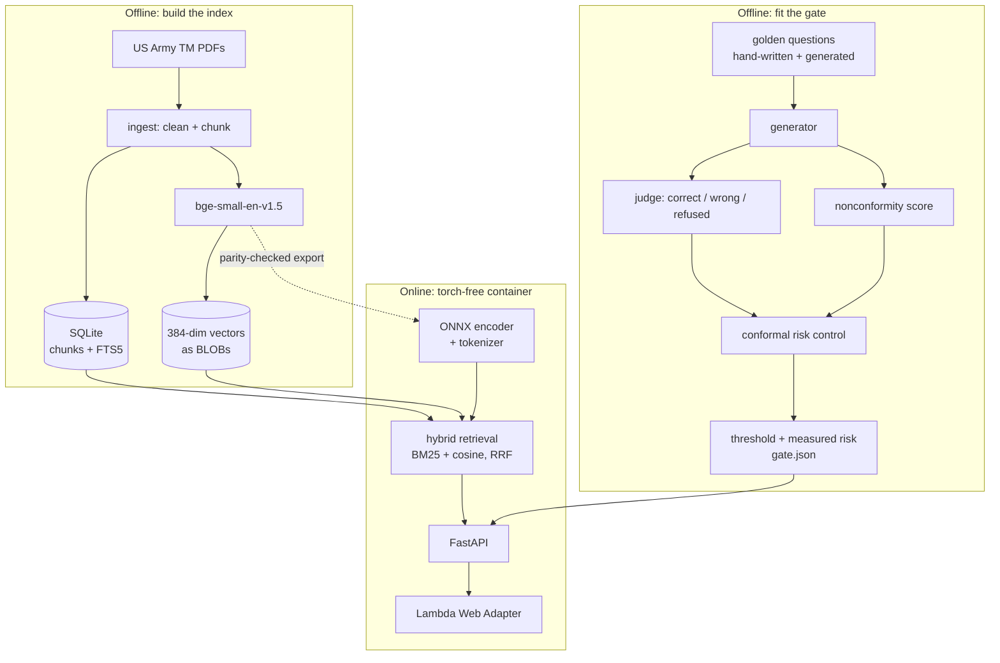

# Architecture

## The boundary that matters: what is calibrated against what

Most of this system is plumbing that could be swapped without consequence. One
number cannot be: the gate threshold is fitted against a specific generator
producing a specific score over a specific corpus. Everything in the layout below
is arranged around keeping that binding visible.

The dotted edge is the one that would fail silently. The index holds vectors
produced by sentence-transformers; the query at serving time is embedded by an
ONNX export. If those two disagree, nothing raises: retrieval just quietly gets
worse. `scripts/export_embedder.py` checks parity against sentence-transformers
before the export is allowed to ship (max |Δ| 2.3e-07, cosine 1.000000), and the
tokenizer travels with the graph because a vocabulary mismatch is the same class
of failure.

## Request path

1. `GET /retrieve?q=…&k=…`
2. The query is tokenized and embedded by onnxruntime, CLS-pooled and L2
   normalised inside the graph.
3. **BM25** over FTS5 and **cosine** over the vector table run independently.
   The vector search is brute force: a few thousand chunks is milliseconds of
   NumPy and has no index to corrupt or rebuild.
4. **Reciprocal rank fusion** merges them, `score = Σ 1/(k + rank)`. RRF needs no
   score normalisation across heterogeneous retrievers, which is exactly the
   BM25-versus-cosine situation.
5. Chunks are hydrated from SQLite and returned with the retrievers that found
   them, so `sources: ["bm25", "vec"]` shows *why* a chunk surfaced.

`GET /gate?score=…` is deliberately separate from generation. The gate is a total
function of the score, so the decision, the threshold, α and the measured risk
can be served without any model at all, and anyone can post their own
generator's score to get the decision this system would make.

## The agent, and why it is written out

`agent.py` is a loop: send the conversation, parse one JSON tool call, execute
it, append the result, repeat until the model emits `final`. Tools are
`search_docs`, `predict_rul` (the live turbofan-rul API) and `calculator`. No
framework. The tool protocol, the guardrails and the loop are a few hundred
lines, so when the behaviour is wrong the bug is in this repository and it is
findable.

Retrieved text is fenced as untrusted data before it reaches the model, and
`evals/injection_cases.jsonl` asserts in CI that instructions embedded in corpus
documents are not followed.

## Storage invariants

- **One SQLite file holds everything at rest**: chunks, the FTS5 index, and
  embeddings as float32 BLOBs. It deploys by being copied.
- **FTS5 is standalone, not external-content.** With an external-content table,
  `SELECT rowid FROM fts` reads through to the content table and the index
  silently stays empty. Chunk ids are monotone, so ingestion indexes everything
  past the FTS high-water mark.
- **The connection is thread-local.** sqlite3 connections cannot cross threads
  and FastAPI runs sync endpoints in a worker threadpool, so a shared connection
  raises on the second request that lands elsewhere. `:memory:` is the exception
  and shares one connection, because a per-thread in-memory database would be
  empty.
- **The served copy is opened read-only and immutable.** See
  [deploy.md](deploy.md) for the three separate ways SQLite fails on Lambda's
  read-only filesystem; the short version is that WAL mode is recorded in the
  file header and drags sidecar files along, so the registry checkpoints the
  index to `journal_mode=DELETE` at build time.

## Serving is torch-free

The training and calibration side needs torch, sentence-transformers, and a
running generator. The container needs none of them: onnxruntime for the
encoder, the `tokenizers` binding, SQLite, and arithmetic for the gate. The
package is installed with `--no-deps` on top of a pinned serving set, and CI
asserts that `torch`, `sentence_transformers` and `pypdf` are all absent from
the image.

`pypdf` is on that list because it was a real leak: `store.py` imports `Chunk`
from `ingest.py`, which imported pypdf at module scope, so the serving image
crashed on a PDF parser it never uses. The import is now lazy.

## CI/CD

- **ci.yml** lints with ruff, runs the suite on 3.11 and 3.12 with no models and
  no network, then builds the serving image, asserts it is torch-free, and boots
  it under `--read-only --tmpfs /tmp` the way Lambda mounts it. With no registry
  present the data routes must answer 503 rather than 500.
- **deploy.yml** fires on a `v*` tag: fetch the registry release asset, build,
  push to ECR, move the Lambda to the new image, then smoke `/health` **and**
  `/gates`, because an image built without a registry starts perfectly happily
  and 503s on every prediction.
- Deploys authenticate by GitHub OIDC. No AWS keys exist anywhere.
